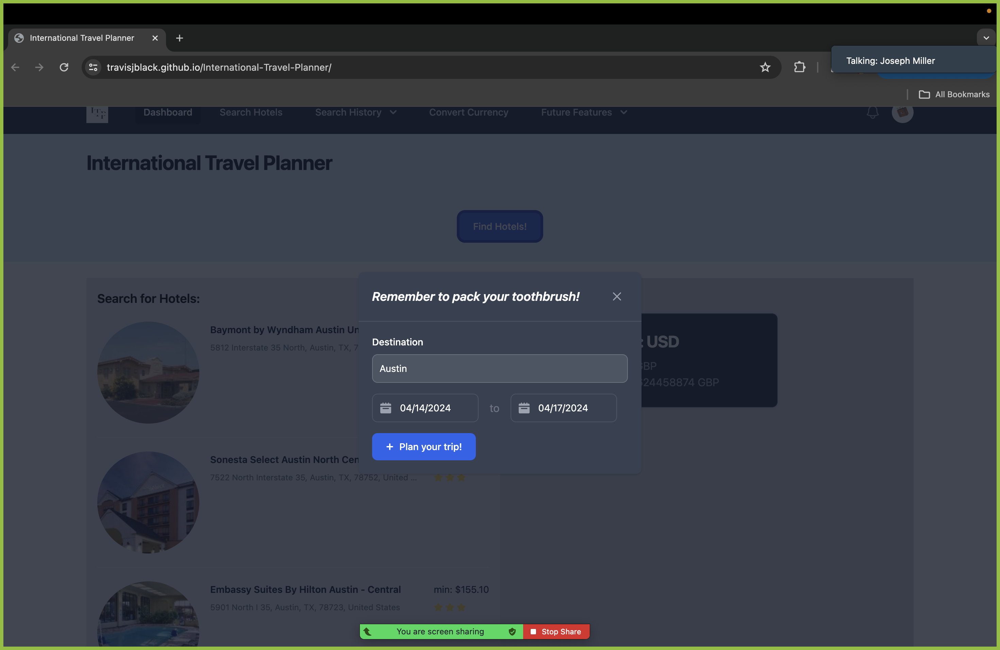

# International Travel Planner

This website serves as an international travel planner and currency converter. This will allow users to plan their trips while also managing their budgets effectively through currency conversion.

## Table of Contents

- [Introduction](#introduction)
- [Features](#features)
- [Installation](#installation)
- [Usage](#usage)
- [Acknowledgements](#acknowledgements)

## Introduction

The International Travel Planner with Currency Conversion is designed to make international trip planning easier. It offers lists of hotels in selected areas, sorted by price to make decisions simpler. Additionally, it provides seamless currency conversion aiding travelers in managing their budgets effectively.

## Features
- **hotel locator**: simply insert the destination you would like to travel to and select a hotel from the given list.**
- **Currency Conversion**: Easily convert currencies to help you manage your budget effectively.
- **User-Friendly Interface**: Intuitive design for seamless navigation and usage.
- **Multi-platform Compatibility**: Accessible on web browsers and mobile devices for convenience.

## Installation

There is no installation required. Simply visit the website using a web browser to access its features.

## Usage

1. Visit the website at https://travisjblack.github.io/International-Travel-Planner
2. Start planning your trip by finding hotels sorted by cost and ratings.
3. Use the currency converter to convert currencies and manage your budget effectively.
## Acknowledgements

Special thanks to the following resources:
- [Bootstrap] (https://getbootstrap.com/) for styling
- [Priceline API](https://rapidapi.com/tipsters/api/priceline-com-provider) for providing hotel data
- [CurrencyLayer API](https://freecurrencyapi.com/) for currency conversion functionality.
-[Tailwind-CSS](https://tailwindcss.com/) for styling.
-[Flowbite](https://flowbite.com/) for styling.

## Photos 

